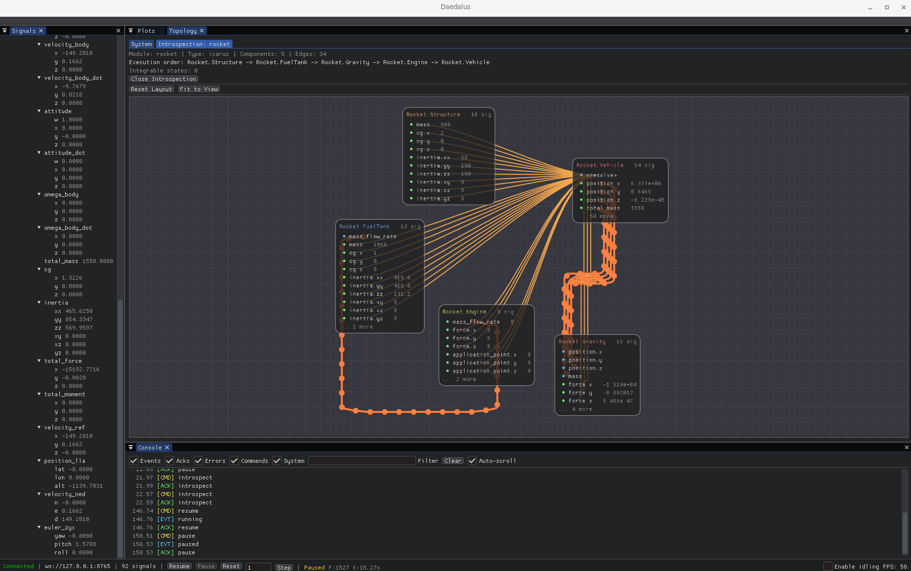

# Daedalus

[](https://github.com/tanged123/daedalus/actions/workflows/ci.yml)
[](https://github.com/tanged123/daedalus/actions/workflows/format.yml)
[](https://codecov.io/github/tanged123/daedalus)
[](https://tanged123.github.io/daedalus/)

**Mission Control Visualization Suite for Hermes Simulations**

Daedalus is a high-density desktop UI for real-time monitoring and control of simulations orchestrated by [Hermes](https://github.com/tanged123/hermes). It speaks the Hermes protocol and visualizes generic signals without hard-coding any specific physics model.

## Screenshot



## What It Provides

- Live signal exploration (tree + sortable table)
- Multi-panel plotting with drag-and-drop signal assignment
- Playback controls (pause, resume, reset, step)
- Topology graph from Hermes `schema.wiring` with auto-layout and live values
- Module introspection subgraphs via Hermes `introspect`:
  - Component-level graph rendering
  - Typed internal edges (`route` and `resolve`)
  - Execution-order pipeline display
- Console with event stream, command history, and command replay

## Architecture

Daedalus is the visualization layer in the Icarus ecosystem:

```
┌─────────────────────────────────────────────────────────────┐
│                    DAEDALUS (Visualizer)                      │
│  ┌──────────┐  ┌──────────┐  ┌──────────┐  ┌──────────┐    │
│  │ Signals  │  │ Plotting │  │ Topology │  │ Console  │    │
│  │Tree/Table│  │ (ImPlot) │  │ (NodeEd) │  │  (Log)   │    │
│  └──────────┘  └──────────┘  └──────────┘  └──────────┘    │
└────────────────────────┬────────────────────────────────────┘
                         │ WebSocket (Hermes Protocol)
                    ┌────┴────┐
                    │ Hermes  │
                    └─────────┘
```

## Tech Stack

| Layer | Library | Purpose |
|:------|:--------|:--------|
| UI Framework | ImGui Bundle | Dear ImGui + Hello ImGui + ImPlot + imgui-node-editor |
| Plotting | ImPlot | High-frequency signal visualization |
| Topology | imgui-node-editor | Block diagram visualization |
| Networking | IXWebSocket | Hermes protocol client with auto-reconnect |
| Data | nlohmann_json | JSON parsing for control channel |

## Quick Start

```bash
# Enter development environment
./scripts/dev.sh

# Build
./scripts/build.sh

# Run Daedalus + Hermes together (default demo config)
./scripts/run.sh

# Run with a specific Hermes config
./scripts/run.sh references/hermes/examples/icarus_rocket.yaml

# Or run Daedalus alone (expects Hermes on ws://127.0.0.1:8765)
./build/daedalus

# Run tests
./scripts/test.sh
```

## Development

All scripts auto-enter the Nix environment if needed:

```bash
./scripts/dev.sh          # Enter Nix development environment
./scripts/build.sh        # Build the project
./scripts/run.sh          # Run Hermes + Daedalus together
./scripts/test.sh         # Run all tests
./scripts/ci.sh           # Full CI (build + test)
./scripts/coverage.sh     # Generate coverage report
./scripts/clean.sh        # Clean build artifacts
./scripts/generate_docs.sh # Generate Doxygen docs
./scripts/install-hooks.sh # Install pre-commit hooks
```

## Hermes Protocol Notes

Daedalus currently consumes:
- `schema` messages including optional module metadata (`module_type`, `supports_introspection`, `component_count`, `edge_count`)
- `ack/subscribe`
- `ack/introspect` including typed `edges` (`source`, `target`, `kind`)
- Binary telemetry frames for signal values

For backward compatibility, introspection still accepts legacy `internal_wiring` payloads when `edges` is not present.

## License

MIT
